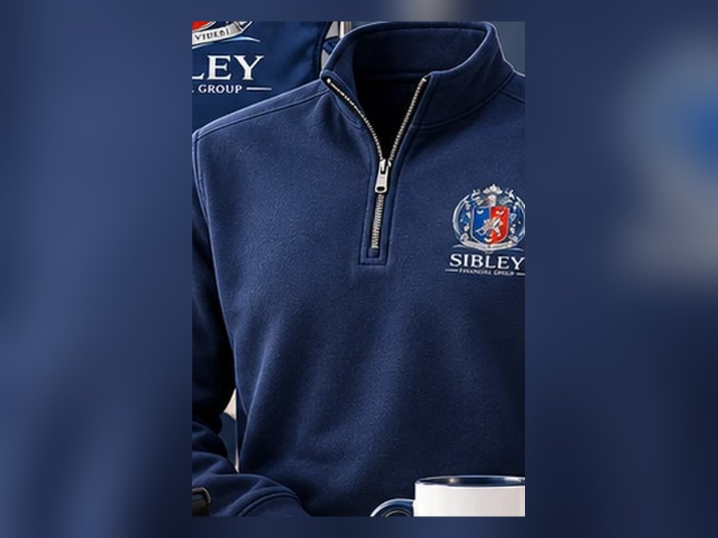

# Sibley Financial Group — Website

A static, dependency-free marketing website for **Sibley Financial Group**, powered by
Allied Elite Financial — an independent retirement planning and wealth management firm
in Mandeville, Louisiana, founded in 2000 by C. Troy Sibley.

The entire site is plain HTML, CSS and vanilla JavaScript. There is no build step, no
framework and no package manager. Open `index.html` in a browser and it works.

---

## ⚠️ Before this site goes live

The site is complete and deployable, but a handful of details could not be verified from
public sources. **Replace these first.**

| What | Where | Current placeholder |
|---|---|---|
| Phone number | Every page (header, footer, contact) | `(985) 000-0000` / `tel:+19850000000` |
| Email address | Every page | `info@sibleyfinancialgroup.com` |
| Street address | `contact.html`, footer, `index.html` JSON-LD | City/state only — no street address |
| Domain name | `<link rel="canonical">`, Open Graph tags, `sitemap.xml`, `robots.txt` | `https://www.sibleyfinancialgroup.com` |
| Office hours | Footer, `contact.html` | Mon–Fri, 9:00am–5:00pm CT |
| Headshot of Troy Sibley | `about.html`, `index.html` | Crest plate stands in — `event.html` now uses a photo |
| Welcome video | `welcome.html` | Poster frame in place; recording still to shoot |
| Event details | `event.html` | Red dashed placeholders throughout |
| Event photographs | `event.html` | Four empty `.photo-slot` frames |

Fastest way to do the first four:

```bash
grep -rn "985) 000-0000\|+19850000000\|sibleyfinancialgroup.com" *.html *.xml *.txt
```

### Content that should be verified

The copy on `about.html` was assembled from publicly available sources (LinkedIn, Marquis
Who's Who, press releases). **Please confirm each claim before publishing**, in particular:

- "25 years" / founded 2000
- Youngest district manager at Union National, a Kemper company
- Top Advisor and Regional Agent of the Year — Transamerica Life; Lincoln Heritage Life
- Marquis Who's Who Emerging Leaders, May 2025
- Great Lakes Christian College
- NAFA membership
- The four statistics in the home page stat bar

### Compliance review

`disclosures.html` contains a **starting template** for general, insurance/annuity,
performance, awards, licensing, privacy and accessibility disclosures, plus the standard
footer disclosure on every page. These are reasonable defaults, not legal advice. They
must be reviewed and amended by the firm's compliance supervisor, carriers and counsel to
match actual licensing, registrations, product lines and state requirements before launch.

---

## Adding a headshot

`event.html` carries a photograph of Troy at `assets/img/troy-sibley.jpg`, cropped from
the welcome-video poster. `about.html` and `index.html` still use a `.portrait` block
showing the crest on a navy plate; they can use the same file, or a dedicated headshot.
To swap one in, replace the inner `<div class="portrait__plate">…</div>` with:

```html

```

A portrait-orientation image around 800×1000px works best (the CSS crops to a 4:5 ratio).

Note on the existing crop: the video poster has a play button in the artwork sitting close
to Troy's shoulder, which caps how wide a badge-free portrait can be cut from it. The
result is good but slightly upscaled — a native portrait photograph would be sharper.

---

## Structure

```
index.html           Home — hero, stats, services, process, advisor, motto, CTA
about.html           Firm story, C. Troy Sibley bio, recognition, values, who we serve
services.html        Six services in detail, plus a plain-language note on compensation
process.html         Four-step planning process and an eight-question FAQ
contact.html         Contact form, direct details, privacy note
disclosures.html     Disclosures, privacy statement, accessibility statement
event.html           Client appreciation LSU game-day event + registration
gifts.html           Choose up to two appreciation gifts + shipping details
welcome.html         Sent to new clients: welcome video, gift box, first 90 days (noindex)
thank-you.html       Shown after a successful contact submission (noindex)
thank-you-rsvp.html  After an event registration (noindex)
thank-you-gift.html  After a gift claim (noindex)
404.html             Not-found page
site.webmanifest     PWA manifest (icons, theme colour)
robots.txt           Points crawlers at the sitemap
sitemap.xml          All six public pages
assets/css/styles.css   The entire stylesheet (~800 lines, heavily commented)
assets/js/main.js       Nav, scroll reveal, counters, accordion, form validation
assets/img/             Logo variants, icons, social share card
```

Shared header and footer markup is duplicated in each page (normal for a site this size —
no build step to go wrong). If you change a nav item, change it in every HTML file.

---

## Branding

Everything is derived from the firm's crest — colours were sampled directly from the logo
artwork, and the ornament (engraved hairlines, the heraldic lozenge on section eyebrows,
the shield-shaped icon plates, the two-tincture rule) echoes its details.

| Token | Value | From |
|---|---|---|
| `--navy-800` | `#0A2044` | Wordmark navy |
| `--navy-700` | `#0C2C52` | Wordmark navy |
| `--royal-700` | `#0A3178` | Azure half of the shield |
| `--crimson-600` | `#B81020` | Gules half of the shield |
| `--silver-200` | `#D5DAE3` | Mantling, helm and griffin |
| `--ivory` | `#F8F6F1` | Ground |

- **Display type:** Cormorant Garamond (a high-contrast serif close to the wordmark)
- **Body type:** Inter
- Both load from Google Fonts via `<link>` in each `<head>`, with system fallbacks.

The motto, *Esse Quam Videri* — "to be, rather than to seem" — is used as the site's
organising idea rather than decoration.

> **Note on the logo artwork:** in the supplied file, the Q in "ESSE QUAM VIDERI" reads
> almost like an O at small sizes. Worth correcting in the source artwork at some point.

### Logo assets

| File | Use |
|---|---|
| `crest-sm.png/.webp` | Header and footer mark (48px) |
| `crest.png/.webp` | Large watermarks, the motto band |
| `logo-lockup.png/.webp` | Full lockup for **light** backgrounds |
| `logo-lockup-reversed.png/.webp` | Full lockup with an ivory wordmark, for **dark** backgrounds |
| `icon-32/180/512.png`, `favicon.ico` | Favicons and app icons |
| `og-image.jpg` | Social sharing card (1200×630) |

All were generated from the original artwork with the white background removed. Each is
served as WebP with a PNG fallback via `<picture>`.

---

## Campaign pages

Three pages are linked from the footer (under **Firm**) rather than the primary
nav, since they are sent directly to clients by email or text rather than
browsed to. All three
are marked `noindex, follow` and kept out of `sitemap.xml`: seats and stock are
limited and the offers are for existing clients, so they should not turn up in
search results. The links still work for anyone you send them to.

### `event.html` — client appreciation event

**On the LSU logo.** This page deliberately carries no LSU logo, wordmark or
other university mark. They are registered trademarks of Louisiana State
University, and using them on a financial firm's promotional material implies
sponsorship or endorsement — the very thing the non-affiliation disclosure on
this page disclaims. Doing it anyway is a real legal exposure.

What the page does instead: purple-and-gold game-day accents (colours are not
trademarkable), a bolder hero, and slots for the firm's own photographs. If
Sibley Financial Group is ever granted a trademark licence or becomes an
official corporate sponsor, LSU issues approved marks and brand guidelines —
there is a marked `.mark-slot` on the page ready for one, and the
`--gameday-purple` / `--gameday-gold` tokens are already in `styles.css`.

**Photographs.** The hero runs on `assets/img/event-suite.jpg`. The gallery
holds two supplied photographs (`event-stadium`, `event-helmet`) plus three
empty `.photo-slot` frames — replace each `<div class="photo-slot">` with an
`` at the 3:4 ratio labelled on it. Real photographs of real clients will
do more for this page than any copy.

⚠️ **Confirm rights to the stadium and helmet photographs.** Copyright is a
separate question from the trademark point above and applies even to images
that are freely findable online. If the firm does not own them or hold a
licence, replace them — the page works with any photographs, and the layout
adapts. The suite photograph appears to have been produced for Sibley and
carries the firm's own crest, so it is the safe one.

**Every event detail is a placeholder.** They render as conspicuous red dashed
markers so the page cannot go out with the wrong date on it:

```bash
grep -n 'class="placeholder"' event.html
```

Replace the text inside each `<span class="placeholder">…</span>` and delete the
wrapper. Once no page uses the class, delete the `.placeholder` rule from
`styles.css` too. Outstanding: opponent, date, kickoff time, venue, section/suite,
pre-game meeting spot and time, parking allowance per family, RSVP deadline.

### `gifts.html` — choose and claim

Laid out as a small shop: category filter chips, a product grid, per-item size
selectors, an "Add to My Gifts" button state and a sticky basket bar listing what
has been chosen, then a checkout-style shipping step.

Twelve gifts, choose up to two. The controls are real checkboxes inside labels,
so selection works with no JavaScript and by keyboard; the script only adds
filtering, the running count and the limit. A chosen item stays visible even when
its category is filtered out, so the basket never disagrees with the grid.

To change the catalogue, edit the `.shop-grid` block — each item is one
`<label class="product">` carrying a `data-category`. The limit lives in
`data-gift-limit="2"` on the form; the filter chips are `.shop-filter` buttons
whose `data-filter` must match a category exactly.

**Product photography.** Each card shows the crest on a tinted ground as a
stand-in. To use real product shots, replace the
`` inside `.product__media` with a 4:3 photograph:

```html

```

An `assets/img/products/` folder is already in place. Shoot or crop everything to
the same ratio and the grid stays even.

Apparel items carry their own size `<select>`. One item (the game tickets) is
marked up as `.gift--feature` with a gold "Limited" ribbon; add or remove that
class to feature a different item.

⚠️ **The game tickets are the item to check first with compliance.** They are
materially higher in value than a mug or a cap, which matters under gift-value
limits and Louisiana's anti-rebating rules. If the value is a problem, deleting
that one `<label class="gift--feature">` block removes it cleanly.

Submissions include **home addresses**. Set a retention habit: export what you
need to fulfil, then delete the submissions from the Netlify dashboard. Say so in
the privacy statement on `disclosures.html`.

### `welcome.html` — new client welcome

Sent to a client after onboarding. Marked `noindex` — it is a private page, not
search content. Two things still to add, both marked on the page:

- **The welcome video.** The poster frame (Troy beside the crest) is in place and
  the page no longer flags it as pending, so it reads as finished; the recording
  itself still needs shooting — 60–120 seconds to camera is plenty.
  The page source carries a setup comment with ready-made markup for a YouTube
  embed or a self-hosted MP4.
  ⚠️ If you embed from YouTube or Vimeo, widen the `Content-Security-Policy` in
  `netlify.toml` to allow their frame and media sources, or the embed is blocked.
  ⚠️ The poster has a play button in the artwork, which is why no overlay badge
  is drawn over it. A real `<video>` or embed draws its own control on top — use
  a poster without the button, or accept the duplicate.
The gift box photograph is in place at `assets/img/welcome-gift-box.jpg`.

⚠️ **Compliance, before any of these circulate.** Client gifts and event
hospitality from an insurance-licensed practice are regulated — gift value limits
apply, and Louisiana has anti-rebating rules restricting inducements offered in
connection with insurance. The disclosure wording on both pages states the gifts
are not contingent on any purchase, but a compliance supervisor should confirm the
value, the wording and who may be offered what before these go out.

---

## The contact form

The form is wired to **Netlify Forms**. No third-party service, no API key, no
server code. On submission Netlify captures the fields, filters spam via the
`company_website` honeypot, and redirects the visitor to `thank-you.html`.

The markup Netlify depends on, in `contact.html`:

```html
<form id="contact-form" name="contact" method="POST" action="/thank-you"
      data-netlify="true" data-netlify-honeypot="company_website" novalidate>
  <input type="hidden" name="form-name" value="contact">
```

Do not remove the hidden `form-name` field — it is how Netlify attributes the
submission.

The site has **three** Netlify forms, each with its own confirmation page:

| Form name | Page | Redirects to |
|---|---|---|
| `contact` | `contact.html` | `/thank-you` |
| `event-rsvp` | `event.html` | `/thank-you-rsvp` |
| `gift-claim` | `gifts.html` | `/thank-you-gift` |

**After the first deploy**, turn on notifications **for each form** so submissions
actually reach a person: Netlify dashboard → **Forms** → pick the form → **Form
notifications** → *Add notification* → *Email notification*. Without this,
submissions are stored in the dashboard but nobody is told about them. Send a test
through each live form and confirm it arrives.

Netlify's free tier covers 100 submissions per month **across all forms combined**.
If you send the gift page to a large client list, watch that ceiling.

The JavaScript still validates everything client-side before the POST. If the
`action` is ever reverted to a placeholder containing `REPLACE_WITH`, the script
falls back to opening the visitor's email client so no enquiry is lost.

---

## Checking your work

```bash
python3 tools/check-css.py
```

Fails if any page uses a class the stylesheet does not define. Worth running
after editing `styles.css`: a deleted rule block produces no console error and
no broken layout warning, so an unstyled section can ship unnoticed.

---

## Running it locally

```bash
python3 -m http.server 8000
# then open http://localhost:8000
```

## Deploying to Netlify

`netlify.toml` is already in the repo: no build command, publish directory `.`,
a rewrite for the form's redirect target, security headers (HSTS, CSP,
nosniff, frame options, referrer and permissions policy) and sensible cache
headers. Nothing to configure at the Netlify end beyond connecting the site.

### 1. Merge to `main`

The site currently lives on the `claude/sibley-financial-website-89sr0u` branch.
Merge it into `main` first, so Netlify deploys from the default branch.

### 2. Connect the repository

1. Sign in at [app.netlify.com](https://app.netlify.com) (a free account is enough).
2. **Add new site → Import an existing project → GitHub**, and pick
   `BernardTeamCerium/SibleyFinancialGroup`.
3. Netlify reads `netlify.toml`, so leave the build settings alone. Deploy.

You get a temporary address like `random-name-123.netlify.app`. Check the whole
site there before pointing the domain at it. From this point on, every push to
`main` redeploys automatically.

### 3. Point the domain

In **Site configuration → Domain management → Add a domain**, enter the domain.
Netlify then shows you exactly what to add at your registrar. Choose one:

- **Easiest — change nameservers.** Netlify manages DNS. Update the two or three
  nameservers at your registrar to the ones Netlify gives you.
  ⚠️ This moves *all* DNS for the domain, **including email (MX records)**. If
  the firm's email runs on that domain, copy the existing MX records into Netlify
  DNS first, or use the option below instead.
- **Safer if email is on the domain — keep your DNS and add records.**
  - `www` → `CNAME` → the value Netlify shows you
  - apex/root (`@`) → `ALIAS`/`ANAME` → `apex-loadbalancer.netlify.com` if your DNS
    provider supports those record types — preferred, since it survives an IP change
  - otherwise apex/root (`@`) → `A` → `75.2.60.5`
    *(always confirm against what Netlify shows you; on High-Performance Edge the
    address is different and appears in the pending-DNS dialog)*

DNS takes anywhere from a few minutes to a few hours to propagate. Netlify
provisions a free Let's Encrypt certificate automatically once it resolves;
then enable **Force HTTPS** in the domain settings.

### 4. Update the domain in the code

Once the real domain is settled, replace `https://www.sibleyfinancialgroup.com`
throughout — canonical tags, Open Graph tags, `sitemap.xml`, `robots.txt` and the
JSON-LD in `index.html` and `about.html`. Getting this wrong hurts search
ranking, so it is worth doing carefully.

### 5. After launch

- Netlify → **Forms** → add an email notification, then send a test enquiry.
- Submit `https://yourdomain.com/sitemap.xml` in
  [Google Search Console](https://search.google.com/search-console).
- Claim or update the firm's **Google Business Profile** and point it at the new
  site — for a local advisory practice this drives more traffic than anything else.
- Check the site on a real phone.

## Accessibility & performance notes

- Semantic landmarks, a skip link, and a labelled primary nav
- Keyboard-operable menu and accordion with correct `aria-expanded` / `aria-controls`
- Visible focus rings, `aria-live` form errors, `aria-invalid` on failed fields
- All animation is suppressed under `prefers-reduced-motion`
- The site is fully readable and usable with JavaScript disabled
- No tracking, no cookies, no third-party scripts (only Google Fonts stylesheets)
- Images carry explicit dimensions and lazy-load below the fold

A print stylesheet is included so a client can print a page cleanly.
